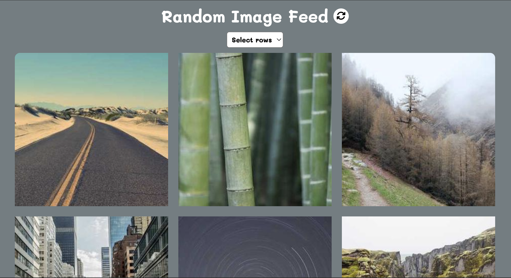

# Random Image Feed



A visually engaging web application that generates a grid of random images fetched from the Picsum API. Built with HTML, CSS, and JavaScript, this project allows users to dynamically adjust the number of rows in the grid, offering a customizable and responsive user experience. It's a great project for showcasing API usage and dynamic DOM manipulation.

## Key Features
- **Random Image Grid**: Fetches random images with varying dimensions from the Picsum API and displays them in a grid.
- **Customizable Rows**: Users can select the number of rows (e.g., 5, 10, 20) to dynamically adjust the grid layout.
- **Responsive Design**: The layout is designed to work seamlessly across all devices, adapting to various screen sizes.
- **Interactive Animations**: Images feature smooth hover effects, and the refresh button includes a spinning animation for a delightful user experience.

## Technologies Used
- **Frontend**: HTML, CSS (for animations and responsive layout).
- **JavaScript**: Handles image fetching, dynamic grid updates, and user interactions.
- **API**: Utilizes the [Picsum API](https://picsum.photos/) for fetching random images.

## How to Run
1. Clone the repository:
   ```bash
   git clone https://github.com/yourusername/Random-Image-Feed.git
   cd Random-Image-Feed
   ```
2. Open `index.html` in your browser to view the application.

## Live Demo
Check out the live demo here: [Link](https://chrisroland.github.io/Random-Image-Feed/)

## Contributions
- Feel free to **open issues** for any bugs or feature suggestions.
- **Pull requests** are welcome for enhancing features or improving performance.
- This project is **open-sourced**, and I appreciate **constructive feedback** and **collaborations**!

Thank you for exploring this project! ❤️